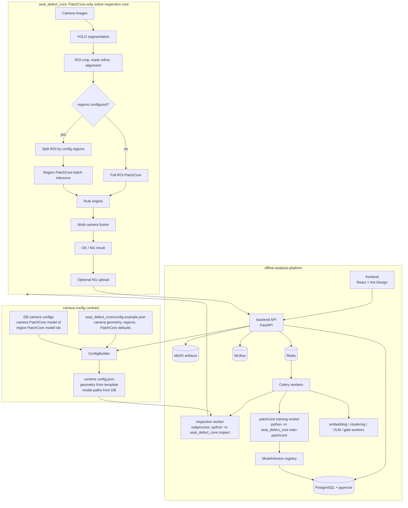

# Industrial AI Offline Analysis Platform

工业座椅缺陷检测离线分析平台。当前分支以 **PatchCore-only** 为在线检测核心：`seat_defect_core` 只保留 YOLO ROI + PatchCore / Region PatchCore 检测逻辑，不保留 EfficientAD 相关检测逻辑。

本仓库是一个 uv workspace monorepo，包含：

- `seat_defect_core`: 在线检测与 PatchCore 训练核心。
- `backend`: FastAPI + Celery 离线平台后端。
- `frontend`: React + Ant Design 管理端。
- `ml`: 离线 embedding、聚类、VLM、分类器等算法模块。

> 当前分支约束：前端和后端的相机 Region 配置只负责绑定 `region_id -> patchcore_model_version_id`。Region 坐标、启用状态、排序和 PatchCore overrides 的权威来源是 `seat_defect_core` 检测配置文件，默认由 `INDUSTRIAL_DEFAULT_INSPECTION_CONFIG` 指向 `seat_defect_core/config.example.json`。

---

## System Architecture



### Runtime Data Flow

1. Frontend selects a seat model, camera(s), and image files.
2. Backend loads `SeatModel`, `CameraConfig`, `CameraConfigRegion`, and referenced `ModelVersion` records.
3. `ConfigBuilder` reads the default inspection config and preserves camera/region geometry from that file.
4. Backend overlays only model paths from DB bindings onto the generated runtime config.
5. Celery inspection worker runs `python -m seat_defect_core inspect`.
6. `seat_defect_core` runs YOLO -> ROI -> PatchCore or Region PatchCore -> rule engine -> fusion.
7. NG results can be uploaded back to the backend for anomaly review, embedding, clustering, and knowledge workflows.

---

## Key Functions

### PatchCore Online Inspection

- YOLO segmentation finds the seat target.
- ROI preprocessing aligns the target into the PatchCore input canvas.
- If `regions` are configured in the core config, each enabled region runs its own PatchCore model.
- If no `regions` are configured, the full ROI PatchCore model is used.
- Full PatchCore backend requires usable backbone weights: either `backbone_pretrained=true` or `backbone_weights_path`.
- Region heatmaps are stitched back into full ROI coordinates for debug artifacts.
- Multi-camera results are fused into a final OK / NG decision.

### Camera And Region Model Binding

- Seat model stores global model references such as YOLO, projector, and whitening matrix.
- Camera config stores the camera-level PatchCore model binding.
- Region config stores only:
  - `region_id`
  - `patchcore_model_version_id`
- Frontend does not edit `x1/y1/x2/y2`, `enabled`, `sort_order`, or region PatchCore overrides.
- Backend validates PatchCore bindings before saving:
  - model version must exist
  - `model_type` must be `patchcore`
  - `artifact_path` must point to an existing file
- `/api/model/options?model_type=patchcore` returns only available PatchCore model files, ordered newest first.

> Database field names still contain historical names such as `efficientad_model_version_id`, `efficientad_image_size`, and `efficientad_threshold` for migration compatibility. In this branch these fields are used as PatchCore camera-level settings.

### PatchCore Training

- Frontend training page can start PatchCore training with normal reference images.
- Backend endpoint: `POST /api/patchcore-training/start`.
- Worker command:

```bash
python -m seat_defect_core train-patchcore \
  --config <config.json> \
  --camera-id <camera_id> \
  --good-images <dir> \
  --output <model.npz> \
  --input-mode roi
```

- Optional `--region-id upper` trains a specific region model using the region definition from the core config.
- Trained `.npz` artifacts are registered as `model_type=patchcore` in `model_versions`.

### Offline Analysis Loop

- NG samples are uploaded to the backend anomaly APIs.
- Embedding workers extract visual features.
- Clustering workers group similar anomalies by `seat_model_id + camera_id + region_id`.
- Review workflows mark real defects or false alarms.
- Knowledge base and rules preserve review decisions.
- Training and model registry workflows produce new model versions.
- Deployment and gate modules manage candidate models and rollout metadata.

---

## Monorepo Structure

```text
offline-analysis-platform/
├── pyproject.toml                  # uv workspace: backend, ml, seat_defect_core
├── uv.lock
├── start.sh                        # local dev startup helper
├── AGENTS.md                       # Codex agent guidance
│
├── seat_defect_core/               # PatchCore-only online inspection core
│   ├── __main__.py                 # CLI: inspect, train-patchcore
│   ├── api.py                      # SeatDefectInspector SDK entrypoint
│   ├── config.py                   # runtime dataclasses
│   ├── config.example.json         # default inspection template
│   ├── runtime_config.py           # validation
│   ├── runtime_config_parsers.py   # JSON/INI parsing
│   ├── anomaly_uploader.py         # optional NG upload
│   ├── fusion.py                   # multi-camera fusion
│   ├── rule_engine.py              # post-processing rules
│   ├── artifacts/                  # debug overlays and heatmaps
│   ├── classifier/                 # optional filter classifier loader
│   ├── core_types/                 # geometry, inputs, pipeline state, results
│   ├── cvops/                      # quality, ROI, region split helpers
│   ├── patchcore/                  # PatchCore engine, features, scoring, color branch
│   ├── service/                    # inspection orchestration and model cache
│   ├── training/                   # PatchCore training
│   ├── yolo/                       # YOLO segmentation integration
│   └── tests/
│
├── backend/
│   ├── app/
│   │   ├── api/
│   │   │   ├── anomaly/            # anomaly upload, query, reprocess
│   │   │   ├── camera_config/      # seat model and camera model bindings
│   │   │   ├── cluster/            # clustering APIs
│   │   │   ├── embedding/          # vector search APIs
│   │   │   ├── gate/               # model gate evaluation
│   │   │   ├── graph/              # similarity graph APIs
│   │   │   ├── hot_reload/         # reload/deployment helper APIs
│   │   │   ├── inspection/         # run seat_defect_core with uploaded files
│   │   │   ├── knowledge/          # knowledge base
│   │   │   ├── mask_refinement/    # image refinement comparison
│   │   │   ├── multimodal/         # VLM analysis
│   │   │   ├── patchcore_training/ # PatchCore training trigger
│   │   │   ├── registry/           # model registry and deployment
│   │   │   ├── review/             # review workflow
│   │   │   ├── rules/              # rule engine CRUD and evaluation
│   │   │   ├── taxonomy/           # defect taxonomy
│   │   │   └── training/           # classifier training
│   │   ├── services/
│   │   │   ├── camera_config/      # ConfigBuilder: template + DB model paths
│   │   │   ├── clustering/
│   │   │   ├── deployment/
│   │   │   ├── embedding/
│   │   │   ├── gate/
│   │   │   ├── knowledge/
│   │   │   ├── mask_refinement/
│   │   │   ├── multimodal/
│   │   │   ├── review/
│   │   │   └── training/
│   │   ├── workers/
│   │   │   ├── inspection_worker/          # invokes seat_defect_core inspect
│   │   │   ├── patchcore_training_worker/  # invokes seat_defect_core train-patchcore
│   │   │   ├── clustering_worker/
│   │   │   ├── embedding_worker/
│   │   │   ├── gate_worker/
│   │   │   ├── graph_worker/
│   │   │   ├── mask_refinement_worker/
│   │   │   ├── training_worker/
│   │   │   └── vlm_worker/
│   │   ├── repositories/           # DB access layer
│   │   ├── models/                 # SQLAlchemy ORM
│   │   ├── schemas/                # Pydantic schemas
│   │   ├── infrastructure/         # DB, MinIO, Celery, pgvector
│   │   ├── core/                   # settings, security, exceptions
│   │   ├── common/                 # logging, shared types, data isolation
│   │   └── tests/
│   ├── alembic/                    # migrations
│   ├── docker-compose.yml          # db, redis, minio, mlflow, api, worker
│   └── pyproject.toml
│
├── frontend/
│   ├── src/
│   │   ├── app/                    # router and layout
│   │   ├── api/                    # Axios clients
│   │   ├── features/
│   │   │   ├── anomaly-browser/
│   │   │   ├── camera-config/      # PatchCore camera and region model binding
│   │   │   ├── cluster-review/
│   │   │   ├── dashboard/
│   │   │   ├── inspection/
│   │   │   ├── knowledge-base/
│   │   │   ├── model-deploy/
│   │   │   ├── rules-engine/
│   │   │   └── training/
│   │   ├── hooks/
│   │   ├── types/
│   │   └── components/
│   └── package.json
│
├── ml/
│   ├── embedding/                  # offline embedding extractors
│   ├── clustering/                 # UMAP/HDBSCAN clustering
│   ├── classifier/                 # offline classifier training modules
│   ├── alignment/
│   └── vlm/
│
├── models/
│   ├── patchcore/                  # local PatchCore artifacts
│   ├── yolo/
│   └── efficientad/                # legacy artifacts may exist, not seat_defect_core logic
│
├── outputs/
└── sample_images/
```

---

## Backend API Overview

| Area | Endpoint prefix | Purpose |
|---|---|---|
| Health | `/health` | service status |
| Anomaly | `/api/anomaly` | NG upload, list, detail, reprocess |
| Camera config | `/api/seat-models` | seat model CRUD, camera config, PatchCore model binding |
| Inspection | `/api/inspection` | upload files and dispatch `seat_defect_core inspect` |
| PatchCore training | `/api/patchcore-training` | upload normal images and train PatchCore |
| Model registry | `/api/model` | model options, register, deploy, rollback |
| Clustering | `/api/cluster` | list clusters, visualization, trigger clustering |
| Embedding | `/api/embedding` | vector search |
| Knowledge | `/api/knowledge` | knowledge base CRUD and search |
| Rules | `/api/rules` | rule CRUD and evaluation |
| Review | `/api/review` | cluster/noise review workflow |
| VLM | `/api/multimodal` | multimodal anomaly explanation |
| Graph | `/api/graph` | similarity graph |
| Gate | `/api/gates` | model gate status and reports |

Swagger docs are available at `http://localhost:8000/docs`.

---

## Frontend Pages

| Route | Page | Function |
|---|---|---|
| `/` | Dashboard | overview charts and statistics |
| `/inspection` | Inspection | choose seat model/cameras, upload images, view OK/NG result |
| `/anomalies` | Anomaly Browser | filter anomalies by seat model, camera, region, status |
| `/clusters` | Cluster Review | cluster review and review actions |
| `/knowledge` | Knowledge Base | defect knowledge entries |
| `/rules` | Rules Engine | rule CRUD and simulation |
| `/training` | Training | classifier and PatchCore training entrypoints |
| `/deploy` | Model Deploy | model deployment records and actions |
| `/cameras` | Camera Config | seat model, camera PatchCore model, region model binding |

Camera Config page intentionally does not expose Region coordinates. Region IDs are model-binding keys; geometry is read by `seat_defect_core` from its config.

---

## Configuration Contract

### Default Inspection Config

Backend setting:

```text
INDUSTRIAL_DEFAULT_INSPECTION_CONFIG=../seat_defect_core/config.example.json
```

`ConfigBuilder` loads this file and matches template cameras by `(seat_model_id, camera_id)`. Matching is case-insensitive as a fallback, so `seat_model_A` can match `seat_model_a`.

### Runtime Config Generation

The generated config uses:

- camera source, ROI, region boxes, region enabled flags, sort order, PatchCore defaults, and region overrides from `seat_defect_core/config.example.json`
- camera-level and region-level PatchCore model paths from DB `model_versions.artifact_path`
- selected camera IDs from the inspection request

If a region model binding references a missing model or a non-existing file, backend camera config save rejects it with HTTP 400 before detection.

---

## Quick Start

### Requirements

- Python 3.11+
- uv
- Docker / Docker Compose
- pnpm

### One-command Local Startup

```bash
./start.sh
```

This starts:

- PostgreSQL + pgvector on `5432`
- Redis on `6379`
- MinIO on `9000/9001`
- MLflow on `5001`
- FastAPI on `8000`
- Celery worker
- Vite frontend on `3000`

Useful variants:

```bash
./start.sh --no-frontend
./start.sh --status
./start.sh --stop
```

### Manual Development Startup

```bash
uv sync --all-packages
docker compose -f backend/docker-compose.yml up -d db redis minio minio-init mlflow
uv run --directory backend alembic upgrade head
uv run --directory backend uvicorn app.main:app --reload --port 8000
uv run --directory backend celery -A app.infrastructure.queue.celery_app worker -l info -c 2
pnpm -C frontend install
pnpm -C frontend run dev
```

### Run seat_defect_core Directly

```bash
uv run python -m seat_defect_core inspect \
  --config seat_defect_core/config.example.json \
  --images cam_back=sample_images/1.png
```

Train a region PatchCore model. Replace `./path/to/good_images` with a directory containing normal reference images:

```bash
uv run python -m seat_defect_core train-patchcore \
  --config seat_defect_core/config.example.json \
  --camera-id cam_back \
  --region-id upper \
  --good-images ./path/to/good_images \
  --output ./models/patchcore/cam_back_upper_patchcore.npz \
  --input-mode online
```

---

## Verification

Focused backend checks:

```bash
uv run --directory backend pytest app/tests/test_camera_config_regions.py -q
uv run --directory backend pytest app/tests/test_e2e_pipeline.py::TestDataIsolationPropagation -q
```

Core checks:

```bash
uv run pytest seat_defect_core/tests -q
```

Frontend check:

```bash
pnpm -C frontend run typecheck
```

Python compile sanity:

```bash
rg --files backend/app seat_defect_core -g '*.py' | xargs python3 -m py_compile
```

---

## Current Branch Notes

- `seat_defect_core` is PatchCore-only.
- EfficientAD-related runtime detection logic is intentionally not part of `seat_defect_core`.
- Some backend/frontend field names still contain `efficientad_*` for DB/API compatibility; their current meaning is PatchCore camera-level config.
- Region geometry is not a frontend responsibility.
- The backend should not expose or accept frontend-edited Region coordinates as authoritative runtime geometry.
- PatchCore model options are filtered by file existence to avoid binding stale model records.
